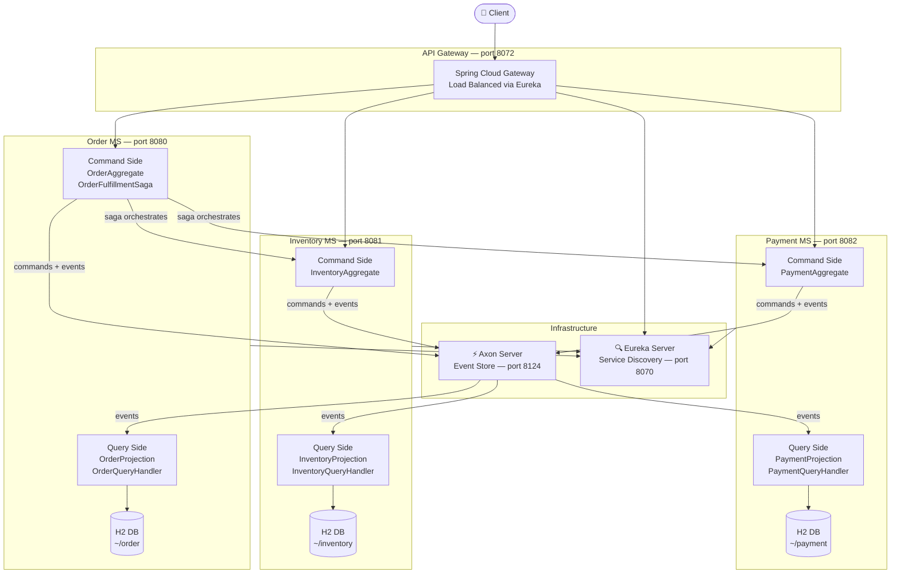
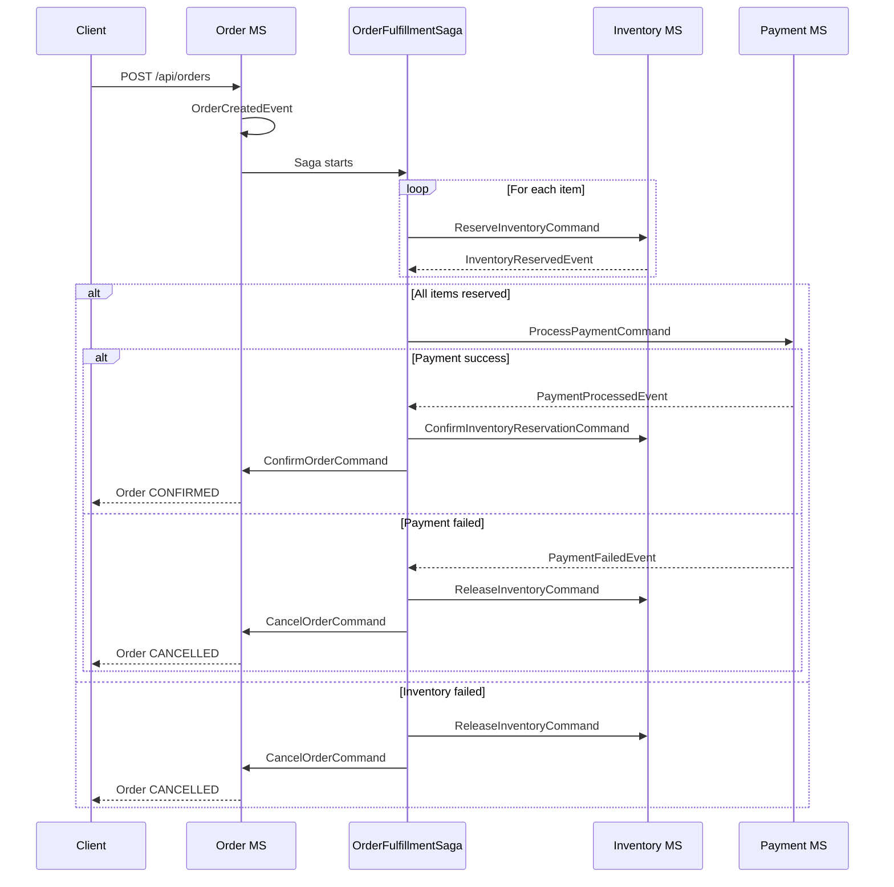

# E-Commerce Event-Driven Microservices

A production-grade e-commerce backend built with CQRS, Event Sourcing, and Saga orchestration using Axon Framework and Spring Boot 3.

---

## Tech Stack

- Java 21
- Spring Boot 3.3
- Axon Framework 4.9.3 (CQRS + Event Sourcing + Saga)
- Axon Server 4.6.11 (Event Store)
- Spring Cloud Netflix Eureka (Service Discovery)
- Spring Cloud Gateway (API Gateway)
- H2 Database (file-based, one per microservice)
- Docker + Docker Compose
- Maven
- SpringDoc OpenAPI (Swagger UI)

---

## Architecture



---

## Saga — Order Fulfillment Flow



---

## CQRS Pattern (per microservice)

```
Write Side                          Read Side
----------                          ---------
REST Controller                     REST Controller
     |                                   |
CommandGateway                      QueryGateway
     |                                   |
Interceptor (validate)              QueryHandler
     |                                   |
Aggregate (business logic)          Repository (H2)
     |                                   ^
AggregateLifecycle.apply(event)          |
     |                              Projection
     v                              (@EventHandler)
Axon Event Store <------------------builds read model
```

---

## Microservices

### Order MS — port 8080
Accepts orders via REST. Hosts the OrderFulfillmentSaga which orchestrates the entire order fulfillment flow across all three microservices.

### Inventory MS — port 8081
Manages product stock levels. Handles stock reservation, release, and confirmation per order item.

### Payment MS — port 8082
Processes payments via a simulated payment gateway (80% success rate for testing both paths).

### API Gateway — port 8072
Single entry point for all client requests. Routes to each microservice via Eureka load balancing.

### Eureka Server — port 8070
Service registry. All microservices register here on startup.

### Axon Server — port 8024 / 8124
Event store and message routing. Stores all events and routes commands, events, and queries between microservices.

---

## Running the Project

### Prerequisites

- Docker and Docker Compose installed
- Java 21
- Maven 3.9+

### Steps

```bash
# Clone the repository
git clone https://github.com/Disha395/ecommerce-cqrs-saga-axon.git
cd ecommerce-cqrs-saga-axon

# Build all microservices
mvn clean package -DskipTests

# Start everything with Docker Compose
docker-compose up --build
```

Services start in this order automatically:
1. Axon Server
2. Eureka Server
3. Order MS, Inventory MS, Payment MS
4. API Gateway

---

## API Endpoints

All requests go through the API Gateway on port 8072.

### Order MS

```
POST   /api/orders                          Place a new order
GET    /api/orders/{orderId}                Get order by ID
GET    /api/orders/customer/{customerId}    Get all orders for a customer
DELETE /api/orders/{orderId}?reason=        Cancel an order
```

### Inventory MS

```
POST   /api/inventory                       Create inventory for a product
GET    /api/inventory/{inventoryId}         Get inventory by ID
GET    /api/inventory/product/{productId}   Get inventory by product ID
```

### Payment MS

```
GET    /api/payments/{paymentId}            Get payment by ID
GET    /api/payments/order/{orderId}        Get payment by order ID
```

---

## Sample Requests

### Step 1 — Create inventory

```json
POST http://localhost:8072/api/inventory
{
  "productId": "prod-001",
  "productName": "Wireless Headphones",
  "quantity": 10
}
```

```json
POST http://localhost:8072/api/inventory
{
  "productId": "prod-002",
  "productName": "Phone Case",
  "quantity": 20
}
```

### Step 2 — Place an order

```json
POST http://localhost:8072/api/orders
{
  "customerId": "cust-001",
  "shippingAddress": "42 Marine Drive, Mumbai",
  "totalAmount": 1299.97,
  "items": [
    {
      "productId": "prod-001",
      "productName": "Wireless Headphones",
      "quantity": 1,
      "unitPrice": 799.99,
      "subTotal": 799.99
    },
    {
      "productId": "prod-002",
      "productName": "Phone Case",
      "quantity": 2,
      "unitPrice": 249.99,
      "subTotal": 499.98
    }
  ]
}
```

### Step 3 — Check the result

```
GET http://localhost:8072/api/orders/{orderId}
GET http://localhost:8072/api/payments/order/{orderId}
GET http://localhost:8072/api/inventory/product/prod-001
```

---

## Dashboards

```
Axon Server Dashboard   http://localhost:8024
Eureka Dashboard        http://localhost:8070
Swagger — Order MS      http://localhost:8080/swagger-ui/index.html
Swagger — Inventory MS  http://localhost:8081/swagger-ui/index.html
Swagger — Payment MS    http://localhost:8082/swagger-ui/index.html
H2 Console — Order      http://localhost:8080/h2-console
H2 Console — Inventory  http://localhost:8081/h2-console
H2 Console — Payment    http://localhost:8082/h2-console
```

---

## Key Design Decisions

**CQRS** — The command side (aggregates) and query side (projections + repositories) are fully separated. Commands mutate state through aggregates and emit events. Queries hit a dedicated read model.

**Event Sourcing** — Aggregate state is never stored directly. It is rebuilt by replaying events from the Axon event store. The event store is the single source of truth.

**Saga Orchestration** — The OrderFulfillmentSaga in Order MS coordinates the distributed transaction. It listens to domain events and sends compensating commands on failure, keeping the system in a consistent state.

**Database per Microservice** — Each microservice owns its own H2 database. No shared databases, no cross-service DB calls.

**Shared Contracts** — All commands and events live in the common module. Each microservice depends only on common, never on each other, keeping them truly independent.

**Compensation (Rollback)** — If inventory reservation or payment fails, the Saga automatically releases reserved stock and cancels the order. No manual intervention needed.

---

## Project Structure

```
ecommerce-cqrs-saga-axon/
├── ecom-bom/           Parent BOM — dependency management
├── common/             Shared commands, events, config
├── order/              Order microservice
├── inventory/          Inventory microservice
├── payment/            Payment microservice
├── api-gateway/        Spring Cloud Gateway
├── eurekaserver/       Eureka service registry
└── docker-compose.yml  Run everything with one command
```

---

## Author

Disha Nayak
GitHub: https://github.com/Disha395